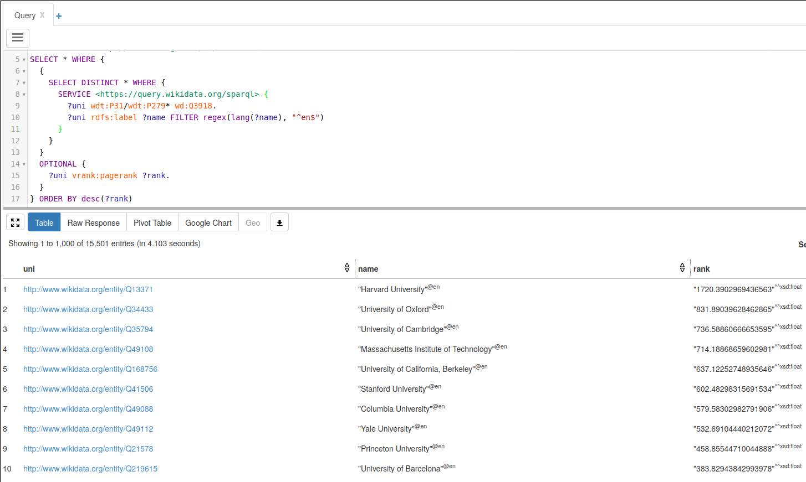

# danker-hdt-docker

### Quickstart:
```
$ wget https://danker.s3.amazonaws.com/2020-11-14.allwiki.links.rank.hdt.bz2 && \
       bunzip2 2020-11-14.allwiki.links.rank.hdt.bz2
$ docker-compose up -d

# open http://localhost in browser.
```

### Example queries:
```
# Universities by PageRank

PREFIX wd: <http://www.wikidata.org/entity/>
PREFIX wdt: <http://www.wikidata.org/prop/direct/>
PREFIX wikibase: <http://wikiba.se/ontology#>
PREFIX bd: <http://www.bigdata.com/rdf#>
PREFIX vrank: <http://purl.org/voc/vrank#>

SELECT * WHERE {
  {
    SERVICE <https://query.wikidata.org/sparql> {
      SELECT DISTINCT ?uni ?uniLabel WHERE {
        ?uni wdt:P31/wdt:P279* wd:Q3918.
        SERVICE wikibase:label {
          bd:serviceParam wikibase:language "[AUTO_LANGUAGE],en".
        }
      }
    }
  }
  OPTIONAL {
    ?uni vrank:pagerank ?rank.
  }
} ORDER BY desc(?rank)
```


```
# 27 Club by PageRank

PREFIX wd: <http://www.wikidata.org/entity/>
PREFIX wdt: <http://www.wikidata.org/prop/direct/>
PREFIX wikibase: <http://wikiba.se/ontology#>
PREFIX bd: <http://www.bigdata.com/rdf#>
PREFIX vrank: <http://purl.org/voc/vrank#>
SELECT DISTINCT * WHERE {
  {
    SERVICE <https://query.wikidata.org/sparql> {
      SELECT ?musician ?musicianLabel ?dob ?dod {
        {
          SELECT ?musician ?dod ?dob WHERE {
            ?musician wdt:P106/wdt:P279* wd:Q639669  ;
                      wdt:P569 ?dob ;
                      wdt:P570 ?dod .
            BIND(FLOOR((?dod - ?dob) / 365.2425) AS ?age).
            FILTER (?age = 27)
          }
        }
        SERVICE wikibase:label {
          bd:serviceParam wikibase:language "[AUTO_LANGUAGE],en".
        }
      }
    }
  }
  OPTIONAL {
    ?musician vrank:pagerank ?rank.
  }
} ORDER BY DESC(?rank)
```

### Additional information
https://github.com/athalhammer/danker

### Used docker images:

* [rogargon/fuseki-hdt-docker](https://github.com/rogargon/fuseki-hdt-docker)
* [erikap/yasgui](https://github.com/erikap/docker-yasgui)
